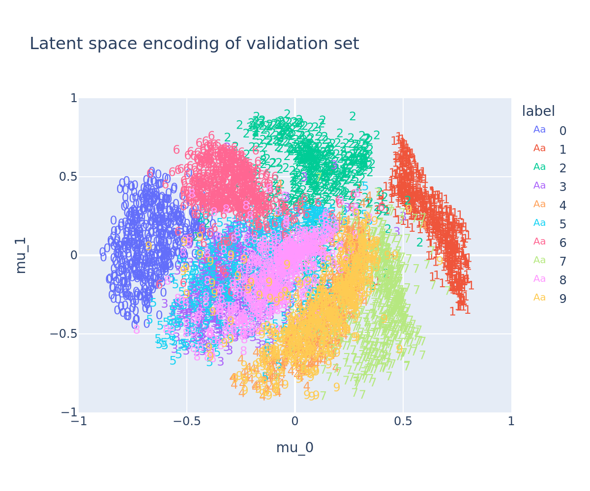

# hyperbolic-vae

Variational autoencoders with latent probability distributions defined on the hyperbolic plane.

Uses https://github.com/emilemathieu/pvae, with some minor modifications to work with recent versions of pytorch

{height=250px width=300px}
